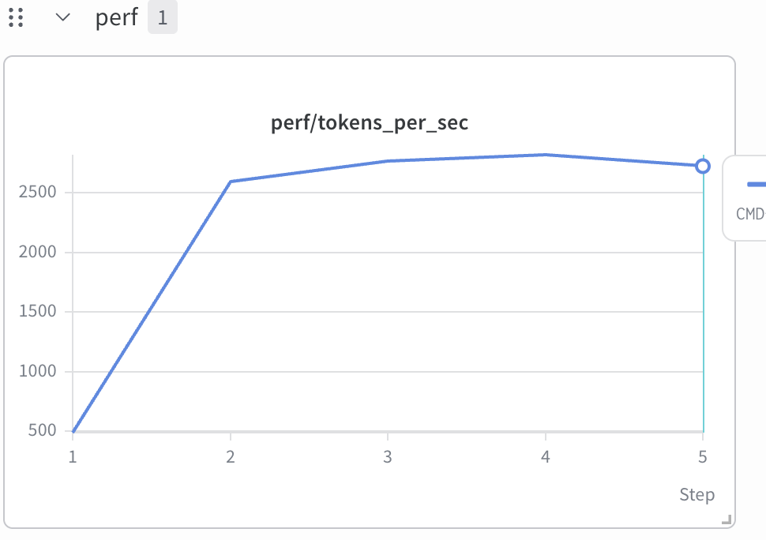
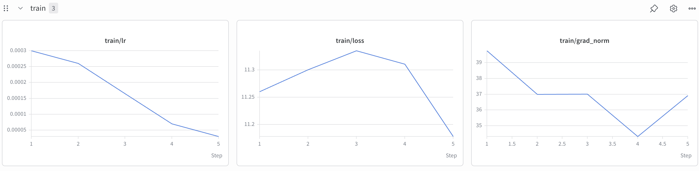

# 1B Dense Model — Toy Pretraining Pipeline

A from-scratch pretraining pipeline for a ~1.24B parameter dense transformer (GQA + RoPE + SwiGLU + RMSNorm), trained on ~25B tokens sampled from [FineWeb-Edu](https://huggingface.co/datasets/HuggingFaceFW/fineweb-edu). It's a toy/learning project: the goal is to exercise the full stack of a real LLM pretraining run — data download, tokenization/packing, a hand-written model and training loop, and multi-GPU DDP — end to end on a small-enough model to actually finish training.

The full architecture, parameter count, and memory/throughput derivation live in [design.md](design.md) (worked through by hand: ~1.24B params, ~12h estimated on 8×H100, batch/sequence-length sizing, etc.) — read that first if you want the reasoning behind the numbers used below.

## Repo layout

| File | Purpose |
|---|---|
| [model.py](model.py) | Model definition: `Transformer1B` (GQA attention, RoPE, SwiGLU FFN, RMSNorm, tied embeddings) |
| [dataset.py](dataset.py) | `PretrainBinaryDataset` — streams fixed-length token chunks out of packed `.bin` shards, sharded per DDP rank |
| [train.py](train.py) | Training loop: LR schedule, gradient accumulation, DDP, checkpointing |
| [download_script.bash](download_script.bash) | Downloads the raw FineWeb-Edu parquet shards |
| [prepare_data_local.py](prepare_data_local.py) | Tokenizes local parquet files and packs them into a single binary token shard |
| [prepare_data_multiprocess.py](prepare_data_multiprocess.py) | Same idea, parallelized across CPU cores for faster tokenization |
| [prepare_data.py](prepare_data.py) | Alternative: streams FineWeb-Edu directly from the Hub (no local parquet download needed) and packs on the fly |
| [design.md](design.md) | Architecture, parameter count, and memory/throughput design notes |

## Requirements

Python 3.x with a virtualenv (this repo uses `.venv/`). Core dependencies:

```bash
pip install torch transformers datasets pyarrow pandas tqdm huggingface_hub
```

You'll also need the `hf` CLI (from `huggingface_hub`) authenticated if the dataset requires it:

```bash
hf auth login
```

## 1. Download the raw data

```bash
bash download_script.bash
```

This pulls a ~86GB slice (`sample/100BT` groups 000-003, ~28.6B raw tokens — comfortable headroom over the 25B-token target) of `HuggingFaceFW/fineweb-edu` into `./fineweb_raw/`, rather than the full dataset. See the comments in [download_script.bash](download_script.bash) for the disk-space math behind that choice. Check available space before running it either way — the packed token shard alone is ~50GB and needs to coexist on disk with the parquet download during packing (see step 2).

## 2. Tokenize and pack into a binary shard

`train.py` reads pretokenized data from flat `.bin` files (uint16 token ids, `EleutherAI/gpt-neox-20b` tokenizer), not from parquet directly. Pack the downloaded data first:

```bash
python prepare_data_local.py
```

This tokenizes every parquet file under `./fineweb_raw/`, appends an EOS token after each document, and writes a fixed-size memory-mapped file (`train_25b_packed.bin`, 25B tokens × 2 bytes ≈ 50GB) to the repo root.

For faster tokenization on a multi-core machine, use the parallelized variant instead:

```bash
python prepare_data_multiprocess.py
```

If you'd rather skip the local parquet download entirely and stream straight from the Hub, use:

```bash
python prepare_data.py
```

Once packing is done, move the `.bin` file(s) into their own directory — `PretrainBinaryDataset` reads every `*.bin` file in whatever `--data_dir` you point it at:

```bash
mkdir -p packed_data
mv train_25b_packed.bin packed_data/
```

## 3. Test locally before committing to a full run

A handful of tiny sanity checks, cheapest first:

```bash
# Model forward pass + param count + initial-loss sanity check
python model.py

# Dataset chunking sanity check (auto-creates ./dummy_data/test.bin if missing)
python dataset.py

# Full training-loop smoke test — a few steps on dummy data, runs on
# CUDA / MPS / CPU automatically depending on what's available
python train.py \
  --data_dir ./dummy_data \
  --out_dir ./checkpoints_local \
  --batch_size 1 --grad_accum_steps 1 --seq_len 128 \
  --max_steps 20 --warmup_steps 5
```

This is the fastest way to catch a broken config, an OOM, or a data-pipeline bug before spending GPU-cluster time on it. Swap `--data_dir` to point at your real `packed_data/` directory (with a small `--max_steps`) to sanity-check against real data too.

## 4. Run the full pretraining job on a GPU cluster

`train.py` auto-detects DDP from the environment (`RANK` / `LOCAL_RANK` / `WORLD_SIZE`), so launch it with `torchrun`. Single node, 8 GPUs:

```bash
torchrun --standalone --nproc_per_node=8 train.py \
  --data_dir ./packed_data \
  --out_dir ./checkpoints \
  --batch_size 4 \
  --grad_accum_steps 8 \
  --seq_len 2048 \
  --max_steps 97000 \
  --warmup_steps 1000 \
  --max_lr 3e-4 \
  --min_lr 3e-5 \
  --compile
```

`--max_steps 97000` comes from the design-doc target of 25B tokens (see [design.md](design.md#L104-L108)); recompute it for your own settings as:

```
max_steps = TOTAL_TOKENS / (batch_size * seq_len * grad_accum_steps * world_size)
```

For multi-node runs, add the standard `torchrun` multi-node flags (`--nnodes`, `--node_rank`, `--master_addr`, `--master_port`) — `train.py` itself needs no changes.

Full CLI options:

| Flag | Default | Meaning |
|---|---|---|
| `--data_dir` | `./dummy_data` | Directory of packed `.bin` shards |
| `--out_dir` | `./checkpoints_local` | Where checkpoints are written locally |
| `--batch_size` | `2` | Micro batch size per GPU |
| `--grad_accum_steps` | `8` | Gradient accumulation steps |
| `--seq_len` | `2048` | Training sequence length |
| `--max_steps` | `1000` | Total optimizer steps |
| `--warmup_steps` | `100` | LR warmup steps |
| `--max_lr` / `--min_lr` | `3e-4` / `3e-5` | Cosine LR schedule bounds |
| `--weight_decay` | `0.1` | AdamW weight decay (only applied to ≥2D weights, not RMSNorm scales) |
| `--save_interval` | `500` | Save `model_latest.pt` every N steps, in addition to the final checkpoint |
| `--resume_from` | `None` | Path to a checkpoint to resume model + optimizer + step from |
| `--auto_resume` | off | If `--resume_from` isn't given, look for `out_dir/model_latest.pt` locally, then `gs://<gcs_bucket>/model_latest.pt` if not found locally; starts fresh if neither exists |
| `--gcs_bucket` | `None` | If set (e.g. `gs://bucket/checkpoints`), upload each checkpoint there via `gcloud storage cp` right after it saves locally |
| `--compile` | off | Enable `torch.compile` |
| `--wandb` | off | Log metrics to Weights & Biases |
| `--wandb_project` | `1bmodel-pretrain` | W&B project name |
| `--wandb_run_name` | `run-YYYY-MM-DD-HH-MM-SS` | W&B run name (auto-timestamped if not set) |
| `--wandb_log_interval` | `10` | Log to W&B every N steps |
| `--gpu_peak_tflops` | auto-detect | Peak bf16 dense TFLOPS for MFU calc; auto-detected for H100/A100 from the GPU name, override for other GPUs |

### Model FLOP Utilization (MFU)

When running on a recognized GPU (currently H100/A100), `train.py` computes and prints/logs `perf/mfu` each step: `MFU = (6 × params × tokens/sec) / (peak TFLOPS × 1e12)`, the standard forward+backward FLOPs-per-token approximation. Use `--gpu_peak_tflops` to supply a peak-TFLOPS value for other GPUs. Real measured MFU for this model was ~44% on A100 80GB and ~31.5% on H100 (no `torch.compile`) — see [docs/gcp-deployment.md](docs/gcp-deployment.md#mfu-tracking) for the full comparison.

## Checkpoints

Two checkpoints are written to `--out_dir`, each asynchronously in a background thread so disk I/O never blocks training:
- `model_latest.pt` — overwritten every `--save_interval` steps (rolling, not versioned)
- `model_final.pt` — written once, after `--max_steps` completes

Both include `model_state_dict`, `optimizer_state_dict` (AdamW momentum/variance — needed to resume without losing training stability), `config`, and `step`. A failed save raises loudly (`RuntimeError`) instead of silently continuing, so a corrupted or incomplete write is never mistaken for success.

**Resuming**: pass `--resume_from path/to/checkpoint.pt` to continue from an exact file, or `--auto_resume` to have it figure out the path itself (see table above) — the latter is what makes unattended recovery after a preemption possible (see [docs/gcp-deployment.md](docs/gcp-deployment.md) for the full auto-recovery setup).

**Backing up to GCS**: pass `--gcs_bucket gs://your-bucket/checkpoints` and every save also gets pushed there under the same filename. A failed upload only logs a warning — it never fails the run, since the local copy is already safe.

## 5. Running on Google Cloud (GCP)

The full pipeline was validated end to end on real GCP GPU hardware (L4 → H100 → A100 40GB → A100 80GB) and is currently running the real 25B-token training job unattended on a preemptible A100 80GB, auto-recovering from preemptions via a Managed Instance Group, with a Cloud Billing budget kill-switch capping spend.

For VM setup, IAM/OAuth scope gotchas, the smoke-test walkthrough, the MIG auto-recovery setup, the budget kill-switch, real GCP-vs-Azure pricing, and the GPU-selection lessons (why A100 40GB OOM'd where H100 and A100 80GB didn't) — see **[docs/gcp-deployment.md](docs/gcp-deployment.md)**.

<p float="left">
  
  
</p>
