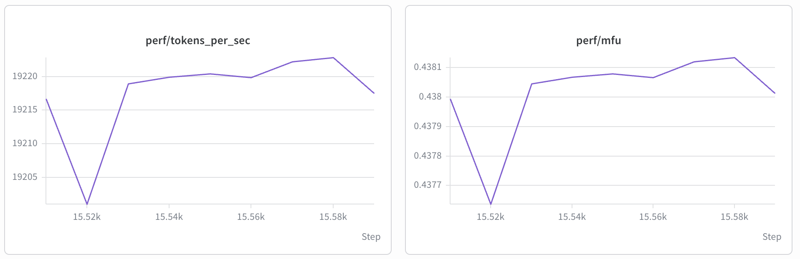
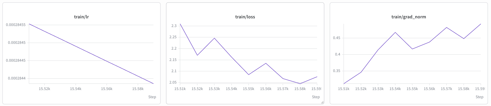
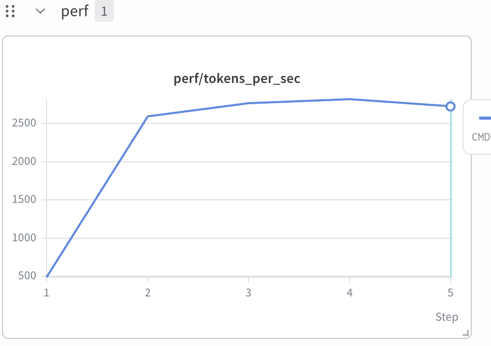
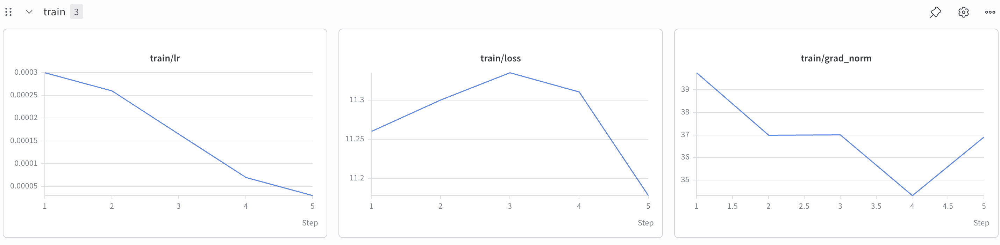

# 1B Dense Model — Pretraining Pipeline

A from-scratch pretraining pipeline for a ~1.24B parameter dense transformer (GQA + RoPE + SwiGLU + RMSNorm), trained on ~25B tokens sampled from [FineWeb-Edu](https://huggingface.co/datasets/HuggingFaceFW/fineweb-edu). The goal is to exercise the full stack of a real LLM pretraining run — data download, tokenization/packing, a hand-written model and training loop, and multi-GPU FSDP2 — end to end, across multiple cloud providers.

The full architecture, parameter count, and memory/throughput derivation live in [design.md](design.md) (worked through by hand: ~1.24B params, ~12h estimated on 8×H100, batch/sequence-length sizing, etc.) — read that first if you want the reasoning behind the numbers used below.

## Results

**Training target:** 25B tokens — 95,367 steps at 262,144 tokens/step (`batch_size=8, grad_accum_steps=16, seq_len=2048`, standard config). **Current position: ~10.4B tokens consumed (~41.5% complete).** Actual parameter count 1,185,204,224 (design doc rounded to 1.24B).

Measured across all real training runs, sourced from W&B (`1bmodel-pretrain`) and CloudWatch logs:

| Cloud | GPU setup | Instance | Pricing | Tok/s | Step time | MFU | Steps | Tokens | Compute | ~Cost | ¢/1M tok |
|---|---|---|---|---|---|---|---|---|---|---|---|
| GCP | H100 80GB (no compile) | `a3-highgpu-1g` | Preemptible Spot | ~43,700 | ~6.0 s | 31.4%† | 0→12,360 | 0→3.2B | ~20.6 h | ~$134 | 4.2¢ |
| GCP | A100 80GB | `a2-ultragpu-1g` | Preemptible Spot | ~19,210 | ~13.6 s | 44%‡ | 12,360→15,510 | 3.2B→4.1B | ~11.9 h | ~$35 | 3.9¢ |
| GCP | A100 40GB | `a2-highgpu-1g` | Preemptible Spot | ~12,900 | ~20.3 s | 29%‡ | OOM at batch≥4 | — | — | — | — |
| AWS | 4×A10G FSDP2 | `ml.g5.12xlarge` | On-demand | ~9,600 | ~27.1 s | 13.7%§ | preflight only | ~4.1B | 0.4 h | ~$3 | — |
| AWS | 4×L4 FSDP2 | `ml.g6.12xlarge` | Managed Spot | ~10,750 | ~24.4 s | 15.7% | 15,510→26,018 | 4.1B→6.8B | 72.1 h | ~$415 | 15.4¢ |
| AWS | 4×L40S FSDP2 | `ml.g6e.12xlarge` | Managed Spot | ~17,270 | ~15.2 s | 8.5% | 26,018→31,175 | 6.8B→8.2B | 22.2 h | ~$202 | 14.4¢ |
| AWS | 1×L40S | `ml.g6e.8xlarge` | Managed Spot | ~10,037 | ~6.5 s | 19.7% | 31,001→65,517 | 8.1B→10.4B‖ | 38.6 h¶ | ~$101 | 4.4¢ |

GCP config: `batch_size=8, grad_accum_steps=16, seq_len=2048`, single GPU, no activation checkpointing. AWS config: `batch_size=4, grad_accum_steps=8, seq_len=2048`, FSDP2, activation checkpointing on.

**Total spend: ~$1,212** — GCP ~$266 (preemptible, hit kill-switch) + AWS **$945.57** (compute ~$734 + S3/transfer/CloudWatch ~$212). AWS breakdown from Cost Explorer: ml.g6.12xlarge ~$390, ml.g6e.12xlarge Spot ~$285, ml.g6e.8xlarge Spot ~$215, preflight/smoke/other ~$56.

Peak TFLOPS per GPU: H100 989T · A100 312T · L40S 362T · L4 121.4T · A10G 125T. MFU formula: `6 × params × tok/s / system_peak_TFLOPS`.

† H100 MFU computed post hoc (no `perf/mfu` W&B field in early runs).

‡ A100 40GB forced to `batch=1` after `batch=8` and `batch=4` both OOM'd; impractical for this workload.

§ A10G: preflight only (<10 steps); MFU representative but not from a sustained run.

‖ g6e.8xlarge resumed from the step 31,001 periodic checkpoint (~8.1B tokens), overlapping ~0.06B tokens already covered by the g6e.12xlarge run (steps 31,001→31,175 at 262,144 tok/step = ~0.045B).

¶ g6e.8xlarge: 38.6 h billable (Spot) / 63.9 h wall-clock (includes capacity wait time). AWS compute costs sourced from SageMaker pricing API + EC2 Spot price history (us-west-2, Sep 27–Oct 5 2026). GCP rates from Cloud Billing Catalog API.

### GPU selection: speed vs. cost

Based on measured data only (actual runs).

| Category | Best choice | Pricing | Why |
|---|---|---|---|
| **Cheapest** | GCP A100 80GB | Preemptible Spot | 3.9¢/1M tok — lowest cost per token of all measured runs |
| **Fastest** | GCP H100 80GB | Preemptible Spot | 43,700 tok/s — 2.3× faster wall-clock than A100 |
| **Best availability** | AWS 1×L40S | Managed Spot | Less subject to GCP preemptible stockouts; on-demand also available |
| **Best overall** | GCP A100 80GB | Preemptible Spot | Cheapest per token + highest MFU (44%) + no FSDP overhead |

Remaining work: ~14.6B tokens (25B − 10.4B).

| GPU | Pricing | ¢/1M tok | $/hr | Tok/s | Est. time (14.6B tok) | Est. cost |
|---|---|---|---|---|---|---|
| GCP A100 80GB | Preemptible Spot | 3.9¢ | ~$2.94 | ~19,210 | ~211h | ~$568 |
| GCP H100 80GB | Preemptible Spot | 4.2¢ | ~$6.50 | ~43,700 | ~93h | ~$604 |
| AWS 1×L40S | Managed Spot | 4.4¢ | ~$2.62 | ~10,037 | ~244h | ~$639 |
| AWS 4×L40S FSDP2 | Managed Spot | 14.4¢ | ~$9.10/hr (4 GPUs) | ~17,270 | ~235h | ~$2,140 |
| AWS 4×L4 FSDP2 | Managed Spot | 15.4¢ | ~$5.76/hr (4 GPUs) | ~10,750 | ~378h | ~$2,180 |

**Why AWS MFU is lower than GCP:** two independent causes compound:
- `activation_checkpointing=True` is required to fit the model on 24GB GPUs; it recomputes block activations in the backward pass (~30% extra FLOPs), reducing effective throughput.
- `batch_size=4` (vs GCP's 8) means less GPU occupancy per step.
- For 4-GPU FSDP2 with no NVLink (PCIe only on these instances), communication overhead is large — parallel efficiency measured at ~43% (17,270 / (4 × 10,037) = 1.72× speedup vs ideal 4×), which is why 1×L40S achieves higher MFU than 4×L40S despite needing fewer resources.

W&B charts from the A100 80GB run (steps ~15,510-15,590, the last stretch before the pause described below) — `perf/tokens_per_sec` and `perf/mfu` track each other exactly, as expected since MFU is just tokens/sec rescaled by a constant:

<p float="left">
  
  
</p>

### Why the faster GPU shows lower utilization

This looks like a contradiction — H100 is ~2.3x faster in wall-clock throughput but uses a *smaller* fraction of its own peak compute. It isn't: MFU is a ratio to peak FLOPS, not a speed, and the two chips aren't balanced the same way.

- H100 has ~3.2x A100's peak bf16 compute (989 vs 312 TFLOPS) but only ~1.7x its memory bandwidth (3.35 TB/s vs 2.0 TB/s). Compute scaled up faster than bandwidth did.
- At this model's size and batch shape, a non-trivial share of step time is memory-bound, non-matmul work: RMSNorm, softmax, elementwise ops (SwiGLU, RoPE), the optimizer step, and kernel-launch overhead. None of that scales with tensor-core throughput — it scales with how fast data moves through HBM.
- On H100, that memory-bound work is a *larger* fraction of step time than on A100, because the matmul portion got much faster while the memory-bound portion barely did. The tensor cores finish their share and then wait.
- This is exactly the class of overhead `torch.compile` targets (kernel fusion → fewer HBM round-trips) — and the H100 number above was measured **without** `--compile`. The gap would likely close significantly with it.

**Open item**: re-run the H100 config with `--compile` and update this table — the current comparison probably understates H100's real ceiling.

### Step counter, GPU count, and LR scaling

The checkpoint's `step` counter reads 65,517, but that number is not directly comparable to the 95,367 target. Steps 0→31,175 ran at 262,144 tok/step (4-GPU config); steps 31,001→65,517 ran at 65,536 tok/step (1-GPU, same micro-batch but no data-parallel — 4× fewer tokens per optimizer step). The step counter advanced 4× faster than tokens in the last run, making 65,517 look like 68% complete when it is only 41.5%. **Tokens are the canonical progress metric.**

GPU count, tok/step, and max_steps are tightly linked:

```
tok/step  = batch_size × grad_accum_steps × seq_len × world_size
max_steps = total_tokens / tok/step
```

Every additional GPU multiplies tok/step by `world_size`, which divides max_steps by the same factor. More GPUs → larger effective batch → fewer, longer steps to cover the same token budget. The LR schedule ticks the same cosine arc from max_lr to min_lr in fewer steps; per token, the LR trajectory is unchanged, but each step "costs" more tokens before the LR budges. If GPU count changes mid-run, max_steps must be rescaled proportionally to maintain the same per-token LR curve — exactly what happened when the run dropped from 4×L40S to 1×L40S (max_steps was adjusted from 95,367 to 159,564). The conventional corollary: a larger effective batch typically calls for a larger LR (square-root scaling rule: `LR ∝ √batch`). In this run, LR was kept constant through the GPU-count change, leaving the single-GPU phase at a slightly sub-optimal LR-to-batch ratio — it still trained, but this is a known trade-off worth revisiting if training resumes.

## Design estimates vs. reality

[design.md](design.md#L35-L51) estimated ~12 hours to complete the full 25B-token run on 8×H100 (DP=8, assumed MFU=0.45, batch=4 at seq_len=8K). What actually happened diverged from that plan in one dimension that mattered far more than compute efficiency: **GPU count**.

- **DDP was never exercised.** This project's `GPUS_ALL_REGIONS` quota stayed capped at 1 for the entire run (see [docs/gcp-deployment.md](docs/gcp-deployment.md)), so every step of real training ran on a single GPU, not the 8 the design assumed. That alone is roughly an 8x wall-clock penalty independent of any per-GPU efficiency.
- **Per-GPU efficiency landed close to plan.** Design assumed MFU=0.45 on H100; measured MFU on A100 (44%) came in almost exactly on target, and H100 (31.5%, uncompiled) is the outlier explained above, not a modeling error.
- **Sequence length and batch shape changed** from the design's `seq_len=8192, batch=4` to the actually-run `seq_len=2048, batch_size=8, grad_accum_steps=16` — same order of tokens/step (262K vs the design's 257K), different shape, driven by the memory constraints below.
- **Status: paused at step 65,517 (~41.5% of target tokens, ~10.4B/25B)**, loss ~2.78 at last AWS step. Training continued on AWS after GCP exhausted its credit budget, running through four different instance types (see table above and full AWS history in [docs/aws-deployment.md](docs/aws-deployment.md#training-history)). **Current checkpoint is in S3** (`s3://1b-model-pretraining/checkpoints/model_latest.pt`, ~13.6 GiB, saved Oct 5) **and is also backed up in GCS and Azure Blob Storage** (see [Multi-cloud model transfer](#multi-cloud-model-transfer)); resuming requires only running the launch command again.
- Cumulative compute actually consumed:

  | Run | GPU | Tokens | GPU-hours | Pricing |
  |---|---|---|---|---|
  | GCP `a3-highgpu-1g` | H100 80GB | 0→3.2B | ~20.6 h | Preemptible Spot |
  | GCP `a2-ultragpu-1g` | A100 80GB | 3.2B→4.1B | ~11.9 h | Preemptible Spot |
  | AWS `ml.g6.12xlarge` | 4×L4 | 4.1B→6.8B | ~72.1 h (259,471s) | Managed Spot |
  | AWS `ml.g6e.12xlarge` | 4×L40S | 6.8B→8.2B | ~22.2 h (79,824s) | Managed Spot |
  | AWS `ml.g6e.8xlarge` | 1×L40S | 8.1B→10.4B | ~38.6 h (139,092s) | Managed Spot |
  | **Total** | | **~10.4B / 25B** | **~165 h** | **~$1,212** (GCP ~$266 + AWS $945.57) |

## Lessons learned

- **The A100 40GB OOM was predictable from the design doc's own memory model, applied to the actual config.** [design.md](design.md#L57-L103)'s static-memory formula (`params × 16 bytes` — bf16 weights + bf16 grads + fp32 momentum + fp32 variance + fp32 master copy) gives ~19GB static for this model's actual 1.185B params. Its activation-memory formula was derived at `batch=1, seq_len=8192`; scaling it to the run's actual shape (`batch=8, seq_len=2048`, i.e. the same total `batch × seq_len` "area" at 2x the design's assumed unit) puts total memory in the mid-30s GB — comfortably under 80GB, but close enough to a 40GB card's ~39.5GB usable ceiling that real-world overhead not modeled in the doc (CUDA context, allocator fragmentation, non-fused attention/optimizer workspace buffers — the doc's "use FlashAttention3 to get memory to 0 bytes" assumption doesn't fully hold with the attention implementation actually used) was enough to tip it into OOM. The lesson: the design doc's memory math is directionally correct and worth re-deriving per actual run config before provisioning, not just trusting the original sizing.
- **Fault-tolerant checkpointing was a prerequisite, not a nice-to-have.** Preemptible A100/H100 capacity crashed the training loop well over a dozen times over the course of the run (visible directly in the W&B run list — most runs live for well under an hour). Without `--auto_resume` + GCS-backed checkpoints and the MIG's automatic replacement-instance recovery, essentially every one of those crashes would have needed manual detection and a manual restart; with it, the only real cost was the wall-clock time capacity actually cost, not lost work.
- **Preemptible-GPU economics cut both ways.** Preemptible/Spot pricing (~$2.90/hr all-in for A100 80GB vs. multiples of that on-demand) is what made this project affordable at all, but it converts "how long will this take" from a compute-throughput question into a capacity-availability question — the multi-day `us-central1-a` stockout cost far more wall-clock time than any inefficiency in the training loop itself.
- **GCP's billing-budget kill-switch is not a real-time safety mechanism.** Its Pub/Sub notifications lagged actual spend by hours to days (observed stuck at "$0.00" while real spend had already passed the $250 threshold and reached ~$266) — it's a backstop for the eventual case, not a guardrail for a tight budget. A self-tracked cost meter (GPU-hours × known SKU rate, computed independently of GCP's billing pipeline) would close this gap; it wasn't in place before this run, and is worth building before resuming.
- **Multi-GPU DDP remains unvalidated in practice**, despite being implemented and code-reviewed (see the DDP/`torch.compile` ordering discussion in the codebase) — the entire real run was gated to a single GPU by GCP's global `GPUS_ALL_REGIONS` quota, which never moved past 1 despite repeated increase requests. The 8x wall-clock gap this created dwarfs every other inefficiency discussed above.

## Multi-cloud model transfer

Checkpoints are plain PyTorch files (`torch.save` / `torch.load`) with no cloud-specific dependency — they move freely between GCS, S3, and Azure Blob Storage. The packed dataset (`train_25b_packed.bin`, ~50GB) is equally portable. Both are now backed up in GCS (original) and Azure Blob Storage (copy); the commands below show how the transfer was done and how to resume training on a new cloud from either source.

### Current checkpoint location

| Store | Path | Contents |
|---|---|---|
| **S3 (primary / latest)** | `s3://1b-model-pretraining/checkpoints/model_latest.pt` | **Step 65,517** checkpoint (~13.6 GiB, saved Oct 5 2026) |
| S3 | `s3://1b-model-pretraining/train_25b_packed.bin` | Packed 25B-token dataset (~50GB) |
| GCS | `gs://YOUR_GCS_BUCKET/checkpoints/model_latest.pt` | Step 15,510 checkpoint (GCP-era backup) |
| GCS | `gs://YOUR_GCS_BUCKET/data/train_25b_packed.bin` | Packed 25B-token dataset (~50GB) |
| Azure Blob | `https://ACCOUNT.blob.core.windows.net/CONTAINER/checkpoints/model_latest.pt` | Step 15,510 checkpoint (copy of GCP-era) |
| Azure Blob | `https://ACCOUNT.blob.core.windows.net/CONTAINER/data/train_25b_packed.bin` | Packed dataset (copy) |

**To get the latest checkpoint (step 65,517) from S3 to GCS or Azure, run:**

```bash
# S3 → GCS (update the GCS backup to the latest step)
aws s3 cp s3://1b-model-pretraining/checkpoints/model_latest.pt - \
  | gcloud storage cp - gs://YOUR_GCS_BUCKET/checkpoints/model_latest.pt

# S3 → Azure Blob (update the Azure backup)
aws s3 cp s3://1b-model-pretraining/checkpoints/model_latest.pt ./model_latest.pt
azcopy copy ./model_latest.pt "https://ACCOUNT.blob.core.windows.net/CONTAINER/checkpoints/model_latest.pt?SAS"
```

### GCS → Azure Blob Storage (initial copy)

```bash
# Install tools
pip install azure-storage-blob
# Install azcopy: https://learn.microsoft.com/en-us/azure/storage/common/storage-use-azcopy-v10

export AZURE_STORAGE_ACCOUNT=yourstorageaccount
export AZURE_CONTAINER=1bmodel
export AZURE_RESOURCE_GROUP=yourresourcegroup

# One-time: create Azure storage resources
az group create --name $AZURE_RESOURCE_GROUP --location eastus
az storage account create --name $AZURE_STORAGE_ACCOUNT \
  --resource-group $AZURE_RESOURCE_GROUP --sku Standard_LRS
az storage container create --name $AZURE_CONTAINER \
  --account-name $AZURE_STORAGE_ACCOUNT --public-access off

# Generate SAS token (write access, 24h)
EXPIRY=$(date -u -v+1d '+%Y-%m-%dT%H:%MZ' 2>/dev/null || date -u -d '+1 day' '+%Y-%m-%dT%H:%MZ')
SAS=$(az storage container generate-sas \
  --account-name $AZURE_STORAGE_ACCOUNT \
  --name $AZURE_CONTAINER \
  --permissions rwl --expiry $EXPIRY --output tsv)
BLOB_URL="https://$AZURE_STORAGE_ACCOUNT.blob.core.windows.net/$AZURE_CONTAINER"

# Copy checkpoint from GCS to local, then upload to Azure
# (run on a cloud VM to avoid home-connection egress)
gcloud storage cp gs://YOUR_GCS_BUCKET/checkpoints/model_latest.pt ./model_latest.pt
azcopy copy ./model_latest.pt "$BLOB_URL/checkpoints/model_latest.pt?$SAS"

# Copy packed dataset (~50GB — needs disk space, or use --block-size-mb to stream)
gcloud storage cp gs://YOUR_GCS_BUCKET/data/train_25b_packed.bin ./train_25b_packed.bin
azcopy copy ./train_25b_packed.bin "$BLOB_URL/data/train_25b_packed.bin?$SAS"
```

### Resuming training on Azure

Full Azure VM setup, quotas, and the training launch command are in **[docs/azure-deployment.md](docs/azure-deployment.md)**. The short version: use `Standard_NC24ads_A100_v4` (1×A100 80GB Spot, ~$0.679/hr) — the same `batch_size=8` config that ran on GCP fits exactly. Pull the checkpoint from Azure Blob at startup and pass `--resume_from ./model_latest.pt` with the same LR-schedule flags as the GCP run.

### Resuming on GCP

The checkpoint is already in GCS. Resize the existing MIG back to 1:

```bash
gcloud compute instance-groups managed resize my-train-mig --region=us-central1 --size=1
```

The startup script pulls the latest checkpoint automatically via `--auto_resume --gcs_bucket gs://YOUR_GCS_BUCKET/checkpoints`.

### Checkpoint portability

All three providers store plain PyTorch checkpoints. When resuming on any cloud:
1. Pull `model_latest.pt` from whatever store is cheapest/fastest to access.
2. Use **the exact same** `--max_steps 95367 --max_lr 3e-4 --min_lr 3e-5` as the GCP run — the cosine LR schedule is a pure function of these values, and any mismatch breaks schedule continuity.
3. The data iterator resets to the beginning on every resume (no position saved) — acceptable for a 25B-token corpus where one epoch is nowhere near complete.

## Repo layout

| File | Purpose |
|---|---|
| [model.py](model.py) | Model definition: `Transformer1B` (GQA attention, RoPE, SwiGLU FFN, RMSNorm, tied embeddings) |
| [dataset.py](dataset.py) | `PretrainBinaryDataset` — streams fixed-length token chunks out of packed `.bin` shards, sharded per data-parallel rank |
| [train.py](train.py) | Training loop: LR schedule, gradient accumulation, FSDP2 (multi-GPU) / plain single-GPU, checkpointing |
| [sm_train.py](sm_train.py), [launch_sagemaker.py](launch_sagemaker.py) | AWS SageMaker entry point and job launcher — see [docs/aws-deployment.md](docs/aws-deployment.md) |
| [requirements.txt](requirements.txt) | Training dependencies (`torch>=2.6` for FSDP2) |
| [download_script.bash](download_script.bash) | Downloads the raw FineWeb-Edu parquet shards |
| [prepare_data_local.py](prepare_data_local.py) | Tokenizes local parquet files and packs them into a single binary token shard |
| [prepare_data_multiprocess.py](prepare_data_multiprocess.py) | Same idea, parallelized across CPU cores for faster tokenization |
| [prepare_data.py](prepare_data.py) | Alternative: streams FineWeb-Edu directly from the Hub (no local parquet download needed) and packs on the fly |
| [design.md](design.md) | Architecture, parameter count, and memory/throughput design notes |

## Requirements

Python 3.x with a virtualenv (this repo uses `.venv/`). Core dependencies:

```bash
pip install torch transformers datasets pyarrow pandas tqdm huggingface_hub
```

You'll also need the `hf` CLI (from `huggingface_hub`) authenticated if the dataset requires it:

```bash
hf auth login
```

## 1. Download the raw data

```bash
bash download_script.bash
```

This pulls a ~86GB slice (`sample/100BT` groups 000-003, ~28.6B raw tokens — comfortable headroom over the 25B-token target) of `HuggingFaceFW/fineweb-edu` into `./fineweb_raw/`, rather than the full dataset. See the comments in [download_script.bash](download_script.bash) for the disk-space math behind that choice. Check available space before running it either way — the packed token shard alone is ~50GB and needs to coexist on disk with the parquet download during packing (see step 2).

## 2. Tokenize and pack into a binary shard

`train.py` reads pretokenized data from flat `.bin` files (uint16 token ids, `EleutherAI/gpt-neox-20b` tokenizer), not from parquet directly. Pack the downloaded data first:

```bash
python prepare_data_local.py
```

This tokenizes every parquet file under `./fineweb_raw/`, appends an EOS token after each document, and writes a fixed-size memory-mapped file (`train_25b_packed.bin`, 25B tokens × 2 bytes ≈ 50GB) to the repo root.

For faster tokenization on a multi-core machine, use the parallelized variant instead:

```bash
python prepare_data_multiprocess.py
```

If you'd rather skip the local parquet download entirely and stream straight from the Hub, use:

```bash
python prepare_data.py
```

Once packing is done, move the `.bin` file(s) into their own directory — `PretrainBinaryDataset` reads every `*.bin` file in whatever `--data_dir` you point it at:

```bash
mkdir -p packed_data
mv train_25b_packed.bin packed_data/
```

## 3. Test locally before committing to a full run

A handful of tiny sanity checks, cheapest first:

```bash
# Model forward pass + param count + initial-loss sanity check
python model.py

# Dataset chunking sanity check (auto-creates ./dummy_data/test.bin if missing)
python dataset.py

# Full training-loop smoke test — a few steps on dummy data, runs on
# CUDA / MPS / CPU automatically depending on what's available
python train.py \
  --data_dir ./dummy_data \
  --out_dir ./checkpoints_local \
  --batch_size 1 --grad_accum_steps 1 --seq_len 128 \
  --max_steps 20 --warmup_steps 5
```

This is the fastest way to catch a broken config, an OOM, or a data-pipeline bug before spending GPU-cluster time on it. Swap `--data_dir` to point at your real `packed_data/` directory (with a small `--max_steps`) to sanity-check against real data too.

## 4. Run the full pretraining job on a GPU cluster

`train.py` auto-detects a multi-process launch from the environment (`RANK` / `LOCAL_RANK` / `WORLD_SIZE`) and then shards the model with FSDP2 (`fully_shard`: parameters, gradients and Adam state are split across GPUs, so per-GPU memory shrinks as GPUs are added — unlike DDP, which replicates everything). Launch it with `torchrun`. Single node, 8 GPUs:

```bash
torchrun --standalone --nproc_per_node=8 train.py \
  --data_dir ./packed_data \
  --out_dir ./checkpoints \
  --batch_size 4 \
  --grad_accum_steps 8 \
  --seq_len 2048 \
  --max_steps 97000 \
  --warmup_steps 1000 \
  --max_lr 3e-4 \
  --min_lr 3e-5 \
  --compile
```

`--max_steps 97000` comes from the design-doc target of 25B tokens (see [design.md](design.md#L104-L108)); recompute it for your own settings as:

```
max_steps = TOTAL_TOKENS / (batch_size * seq_len * grad_accum_steps * world_size)
```

For multi-node runs, add the standard `torchrun` multi-node flags (`--nnodes`, `--node_rank`, `--master_addr`, `--master_port`) — `train.py` itself needs no changes.

Full CLI options:

| Flag | Default | Meaning |
|---|---|---|
| `--data_dir` | `./dummy_data` | Directory of packed `.bin` shards |
| `--out_dir` | `./checkpoints_local` | Where checkpoints are written locally |
| `--batch_size` | `2` | Micro batch size per GPU |
| `--grad_accum_steps` | `8` | Gradient accumulation steps |
| `--seq_len` | `2048` | Training sequence length |
| `--max_steps` | `1000` | Total optimizer steps |
| `--warmup_steps` | `100` | LR warmup steps |
| `--max_lr` / `--min_lr` | `3e-4` / `3e-5` | Cosine LR schedule bounds |
| `--weight_decay` | `0.1` | AdamW weight decay (only applied to ≥2D weights, not RMSNorm scales) |
| `--save_interval` | `500` | Save `model_latest.pt` every N steps, in addition to the final checkpoint |
| `--resume_from` | `None` | Path to a checkpoint to resume model + optimizer + step from |
| `--auto_resume` | off | If `--resume_from` isn't given, look for `out_dir/model_latest.pt` locally, then `<remote_dir>/model_latest.pt` if not found locally; starts fresh if neither exists |
| `--remote_dir` (alias `--gcs_bucket`) | `None` | If set (`gs://bucket/path` or `s3://bucket/path`), upload each checkpoint there (`gcloud storage cp` / `aws s3 cp`) right after it saves locally |
| `--activation_checkpointing` | off | Recompute block activations in backward (~30% slower, much less activation memory) — lets a larger `--batch_size` fit on 24GB GPUs |
| `--defer_grad_sync` | off | FSDP only: reduce-scatter gradients only on the last micro-step of each accumulation window (less communication, more memory) |
| `--seed` | `1337` | Model-init seed; must match across ranks under FSDP |
| `--compile` | off | Enable `torch.compile` |
| `--wandb` | off | Log metrics to Weights & Biases |
| `--wandb_project` | `1bmodel-pretrain` | W&B project name |
| `--wandb_run_name` | `run-YYYY-MM-DD-HH-MM-SS` | W&B run name (auto-timestamped if not set) |
| `--wandb_log_interval` | `10` | Log to W&B every N steps |
| `--gpu_peak_tflops` | auto-detect | Peak bf16 dense TFLOPS for MFU calc; auto-detected for H100/A100 from the GPU name, override for other GPUs |

### Model FLOP Utilization (MFU)

When running on a recognized GPU (currently H100/A100), `train.py` computes and prints/logs `perf/mfu` each step: `MFU = (6 × params × tokens/sec) / (peak TFLOPS × 1e12)`, the standard forward+backward FLOPs-per-token approximation. Use `--gpu_peak_tflops` to supply a peak-TFLOPS value for other GPUs. Real measured MFU for this model was ~44% on A100 80GB and ~31.5% on H100 (no `torch.compile`) — see [docs/gcp-deployment.md](docs/gcp-deployment.md#mfu-tracking) for the full comparison.

## Checkpoints

Two checkpoints are written to `--out_dir`, each asynchronously in a background thread so disk I/O never blocks training:
- `model_latest.pt` — overwritten every `--save_interval` steps (rolling, not versioned)
- `model_final.pt` — written once, after `--max_steps` completes

Both include `model_state_dict`, `optimizer_state_dict` (AdamW momentum/variance — needed to resume without losing training stability), `config`, and `step`. A failed save raises loudly (`RuntimeError`) instead of silently continuing, so a corrupted or incomplete write is never mistaken for success.

**Resuming**: pass `--resume_from path/to/checkpoint.pt` to continue from an exact file, or `--auto_resume` to have it figure out the path itself (see table above) — the latter is what makes unattended recovery after a preemption possible (see [docs/gcp-deployment.md](docs/gcp-deployment.md) for the full auto-recovery setup).

**Backing up to GCS**: pass `--gcs_bucket gs://your-bucket/checkpoints` and every save also gets pushed there under the same filename. A failed upload only logs a warning — it never fails the run, since the local copy is already safe.

## 5. Running on Google Cloud (GCP)

The full pipeline was validated end to end on real GCP GPU hardware (L4 → H100 → A100 40GB → A100 80GB) and is currently running the real 25B-token training job unattended on a preemptible A100 80GB, auto-recovering from preemptions via a Managed Instance Group, with a Cloud Billing budget kill-switch capping spend.

For VM setup, IAM/OAuth scope gotchas, the smoke-test walkthrough, the MIG auto-recovery setup, the budget kill-switch, real GCP-vs-Azure pricing, and the GPU-selection lessons (why A100 40GB OOM'd where H100 and A100 80GB didn't) — see **[docs/gcp-deployment.md](docs/gcp-deployment.md)**.

For running on AWS (SageMaker, 4× A10G `ml.g5.12xlarge`, FSDP2, Managed Spot Training with S3 checkpoints) — including one-time bucket/IAM/quota setup and moving the GCP checkpoint over — see **[docs/aws-deployment.md](docs/aws-deployment.md)**. Note: AWS credit ($945.57 total) is now exhausted after real training runs across g5/g6/g6e instances — see [docs/aws-deployment.md](docs/aws-deployment.md#training-history) for the full job history.

For running on Azure (`Standard_NC24ads_A100_v4`, 1×A100 80GB Spot, ~$0.679/hr) — including storage account setup, copying checkpoints from GCS, and the VM startup script — see **[docs/azure-deployment.md](docs/azure-deployment.md)**.

<p float="left">
  
  
</p>
